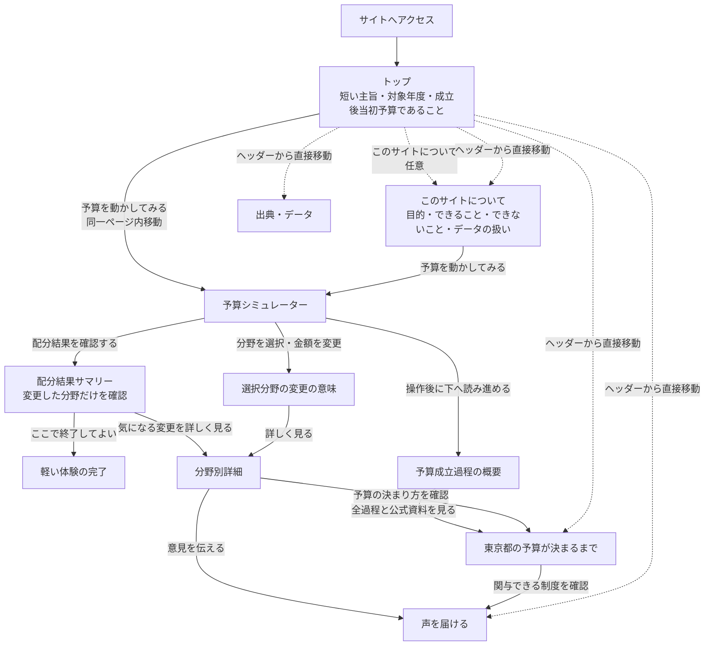

# 東京予算ラボ 仕様書

- 文書名：東京予算ラボ MVP／ハッカソン提出仕様
- バージョン：0.1
- 作成日：2026-08-06
- 対象年度：令和8年度（2026年度）東京都一般会計当初予算
- ステータス：企画整理・プロトタイプ拡張前
- 想定応募：都知事杯オープンデータ・ハッカソン
- 非公式サービス：東京都の公式サービスではない

---

## 1. サービス概要

「東京予算ラボ」は、東京都の実際の年度予算を利用者が分野別に増減し、その変更が現実には何を意味するのかを学ぶ、インタラクティブな財政理解・都政参加支援サービスである。

既存の予算ダッシュボードは、決定済みの金額や構成比を閲覧する用途が中心である。本サービスは、利用者が予算を自分で動かすことで、次の流れを体験できるようにする。

```text
情報提供
  ↓
仮想的な再配分
  ↓
変更した予算項目の意味を知る
  ↓
減額・増額を実行する場合の選択肢を知る
  ↓
国内外で実際に起きた事例を見る
  ↓
東京都で現在の予算が成立した流れを知る
  ↓
現実の参加手段・担当窓口へ接続する
```

本サービスは、予算変更による社会的成果を自動予測するものではない。公開資料から確認できる事実、国内外の事例、アプリによる解釈を分離して表示する。

---

## 2. 背景と課題仮説

### 2.1 対象テーマ

都知事杯オープンデータ・ハッカソンのテーマ：

> 国や自治体の政策や財政を分かりやすく可視化

### 2.2 課題仮説

東京都は予算概要、予算見える化ボード、各局要求、査定結果などを公開している。しかし一般利用者にとっては、次の情報が分断されている。

- 予算の金額と構成比
- 各予算項目が実際に何へ使われるか
- 予算の増額・減額・据え置きが、どのサービス、実施能力、負担、将来費用を変えることか
- 現在の金額がどのような過程で決まったか
- 都民がどこへ、いつ、どの制度を通じて意見を伝えられるか

予算グラフを閲覧するだけでは、各項目を増減した際のトレードオフや、行政財政上の意味を理解しにくい。

### 2.3 解決方針

海外で実績のある Liverpool’s Budget Challenge 型の操作体験を東京都の実予算へ適用する。

ただし、東京都公式の予算協議ツールではないため、意見を直接収集して予算へ反映するサービスとは位置付けない。次の要素を追加し、日本・東京都向けに再構成する。

- 東京都の公式オープンデータを初期値に利用
- 各予算項目の基礎説明
- 増額・減額・据え置きごとの具体的な方法と制約
- 国内外の公的な増額・削減・再編事例
- 各局要求、財務局査定、知事査定、都議会議決の流れ
- 担当局、都民の声、請願・陳情等への導線
- 事実、事例、推測不能事項の明確な分離

---

## 3. サービスの目的

### 3.1 主目的

利用者が東京都の予算を自分で動かしながら、次の内容を体験的に理解できるようにする。

1. 予算総額には限りがある
2. すべての政策分野を同時に増額することはできない
3. 「公債費」「税連動経費等」など、名称だけでは意味が分かりにくい項目がある
4. 予算の増額・減額・据え置きは、金額だけで実施内容が決まるわけではない
5. 増額には機会費用・実施能力・恒常経費等の制約があり、減額にはサービス低下・負担移転・将来費用等の論点がある
6. 現在の予算は、要求、査定、知事判断、議会審議を経て成立している
7. 都民が予算や政策について意見を伝える制度がある
8. 意見提出によって予算への反映が保証されるわけではない

### 3.2 副目的

- 中高生や一般都民向けの主権者教育教材として利用できる
- 東京都の予算関連資料への入口になる
- 行政用語や予算編成過程の理解を助ける
- 都民が自分の関心分野の担当局・窓口を探しやすくする

---

## 4. 対象ユーザー

### 4.1 主対象

- 東京都の予算に詳しくない一般都民
- 中学生・高校生・大学生
- 主権者教育や公共政策教育の受講者
- 都政や特定の政策分野に関心を持った人

### 4.2 副対象

- 教員・ワークショップ運営者
- 行政職員・議員
- オープンデータ活用者
- 他自治体向けに同様のサービスを作りたい開発者

### 4.3 想定利用場面

- 予算発表時の特設コンテンツ
- 学校授業や自治体財政の学習
- 都民向けイベント・ワークショップ
- 選挙や政策議論前の基礎理解
- パブリックコメントや請願・陳情を検討する前の情報収集

---

## 5. 提供価値

### 5.1 一文での説明

> 東京都の予算を自由に動かすと、その変更が現実には何を意味するのかを、国内外の実例と東京都の公式資料から確認できる。

### 5.2 既存サービスとの差分

| 種類 | 主な機能 | 本サービスとの差 |
|---|---|---|
| 予算見える化ボード | 決定済み予算を閲覧 | 自分で増減し、変更の意味を調べられる |
| 財政教育用シミュレーター | 予算を組み替える | 実例、東京都の成立過程、参加先まで接続する |
| 海外の予算シミュレーター | 削減額と想定影響を表示 | 国内外の公的な実例と東京都の公式資料を併記する |
| 行政の意見提出ページ | 意見を提出する | 予算項目の理解と操作結果から適切な制度へ誘導する |
| 行政資料リンク集 | 資料を一覧表示 | 利用者が変更した分野・金額を入口に資料を提示する |

### 5.3 新規性の主張

「予算シミュレーター自体が世界初」とは主張しない。

次を本サービスの独自性とする。

- 日本では分断されている予算可視化、財政教育、編成過程、参加窓口を一つの体験に統合
- 利用者の変更額を保持したまま分野別詳細へ遷移
- アプリ独自の成果予測ではなく、公的資料で確認できる実際の削減事例を提示
- 東京都の予算要求・査定・知事判断・議会議決を段階別に提示
- 事実、他地域の事例、アプリの解釈、判断不能事項を分離

---

## 6. 現行プロトタイプ

現行サイト名：

> 東京予算ラボ

現行プロトタイプで実装済みの主な機能：

- 令和8年度東京都一般会計当初予算の表示
- 分野別スライダーによる70～130％の仮想再配分
- 固定された年間総予算、配分済み予算、配分可能額のリアルタイム表示
- 成立予算と利用者配分の比較
- 増減した分野だけを確認し、そこで体験を終えられる配分結果サマリー
- 全9分野の共通詳細ページと、詳細・予算過程・参加制度を往復できる利用者配分の引継ぎ
- 変更方法、根拠区分、事例、予算背景、公式資料、参加先の表示
- 各局要求、財務局査定、知事査定の代表例
- 基金、都債、都税の概要表示
- 請願、陳情、都民の声、パブリックコメントの説明
- 出典、資料段階、取得日等の表示
- 推測による政策効果量を表示しない方針

現行プロトタイプの課題：

- 増減額に応じた「減らすとは何か」の説明が不足
- 国内外の削減事例がない
- 予算成立過程が簡易表示にとどまる
- 選択した分野と参加窓口の接続が弱い
- 表示データがソースコードへ直接記述され、CSV取得・変換処理が残っていない
- 「8種類のCSVから機械取得」という表現と、配布ソースの状態が一致していない
- ダウンロード版は ChatGPT Sites／Vinext 固有設定を含み、一般的なローカル起動に向かない

---

## 7. スコープ

## 7.1 MVP必須範囲

### 全9分野で実装する内容

- 分野名
- 成立予算額
- 構成比
- 短い説明
- 主な用途
- 利用者の変更額・変更率
- 増額・減額時に考える論点
- 東京都の公式資料リンク
- 主な所管局
- 意見提出制度への導線

対象分野：

1. 福祉と保健
2. 教育と文化
3. 労働と経済
4. 生活環境
5. 都市の整備
6. 警察と消防
7. 企画・総務
8. 公債費
9. 税連動経費等

### 3分野で詳細実装する内容

以下の3分野を、デモ可能な完成度で詳しく実装する。

1. 公債費
2. 福祉と保健
3. 教育と文化

詳細実装には次を含む。

- その予算項目の定義
- 利用者の変更額
- 減額を実現する複数の方法
- 方法ごとの短期・中長期の論点
- 国内の公的事例
- 海外の公的事例
- 東京都の要求・査定・成立予算の背景
- 公式資料
- 担当局・参加先
- 推測できない事項の明示

### 独立ページ

- 東京都の予算が決まるまで
- 声を届ける
- 出典・データ
- このサイトについて

## 7.2 ファイナリスト向け推奨範囲

- CSV取得・正規化処理の再現可能化
- 3分野の詳細ページ完成
- 予算成立フローのインタラクティブ表示
- 選択中の分野に応じた参加先の動的表示
- 5～10人程度の利用者テスト
- 2分動画用の操作シナリオ
- スマートフォン表示の調整
- 出典切れ・リンク切れ確認

## 7.3 将来拡張

- 残り6分野の事例拡充
- 複数年度比較
- 補正予算・決算との比較
- 国・都・区市町村の役割比較
- 利用者案の保存・共有
- 学校授業向けワークシート
- 他自治体データへの横展開
- 多言語対応
- 行政公式の予算協議ツールへの発展

---

## 8. サイトマップ

```text
東京予算ラボ
│
├─ 1. トップ／予算シミュレーター
│   ├─ 東京都予算の概要
│   ├─ 予算成立段階の概要
│   ├─ 分野別スライダー
│   ├─ 年間総予算・配分済み・配分可能額
│   ├─ 成立予算と利用者案の比較
│   ├─ 配分結果サマリーへの導線
│   └─ 分野別詳細への導線
│
├─ 2. 配分結果サマリー
│   ├─ 分野間で配分し直した金額
│   ├─ まだ配分していない金額
│   ├─ 増やした分野
│   ├─ 減らした分野
│   └─ 分野別詳細への任意導線
│
├─ 3. 分野別詳細
│   ├─ 福祉と保健
│   ├─ 教育と文化
│   ├─ 労働と経済
│   ├─ 生活環境
│   ├─ 都市の整備
│   ├─ 警察と消防
│   ├─ 企画・総務
│   ├─ 公債費
│   └─ 税連動経費等
│
├─ 4. 東京都の予算が決まるまで
│   ├─ 都民・団体・会派からの意見
│   ├─ 各局予算要求
│   ├─ 財務局査定
│   ├─ 知事査定
│   ├─ 予算案
│   ├─ 都議会審議
│   ├─ 議決・成立
│   └─ 執行・決算・政策評価
│
├─ 5. 声を届ける
│   ├─ 担当局への問い合わせ
│   ├─ 都民の声
│   ├─ パブリックコメント
│   ├─ 請願
│   ├─ 陳情
│   └─ 都議会議員・会派
│
├─ 6. 出典・データ
│   ├─ 予算CSV
│   ├─ 予算要求
│   ├─ 財務局査定
│   ├─ 知事査定
│   ├─ 予算案・成立予算
│   ├─ 都議会資料
│   ├─ 政策・事業評価
│   └─ 国内外の事例資料
│
└─ 7. このサイトについて
    ├─ 目的
    ├─ できること
    ├─ できないこと
    ├─ 数値・事例・解釈の扱い
    └─ 非公式サービスの明記
```

## 8.1 画面遷移図

「このサイトについて」は詳しい主旨を確認するための独立ページとするが、利用開始時に必ず通るゲートにはしない。トップでは最低限の前提を短く伝え、「予算を動かしてみる」から同じページ内のシミュレーターへ移動できるようにする。



### 遷移方針

- トップの主旨説明は2～3行程度とし、シミュレーター到達前に長い説明を強制しない。
- 操作前に「令和8年度の成立後当初予算を基準にした仮想シミュレーション」であることを表示する。
- 「予算を動かしてみる」は別ページへ遷移させず、トップ内のシミュレーターへスクロールする。
- 変更後は配分結果サマリーで増減した分野だけを確認でき、そこで閲覧を終えてもよい。詳細、予算過程、参加制度は任意の深掘りとする。
- 予算成立過程は、トップでは短い概要、独立ページでは全段階・主体・判断・公式資料・参加可能性・限界を表示する。
- ヘッダーから各独立ページへ直接移動できるようにし、利用者へ一つの閲覧順序を強制しない。
- PCでは成立過程の概要をシミュレーター下部に表示し、スマートフォンではアコーディオンまたは縦タイムラインとして表示する。

---

## 9. 画面仕様

## 9.1 トップ／予算シミュレーター

### 目的

利用者が東京都の予算概要を知り、直感的に分野別配分を変更する。

### 表示内容

- サービス名
- 対象年度
- 一般会計総額
- 都税等の主要財源
- 「成立後当初予算」を初期値にしていること
- 予算成立段階の概要
- 分野別予算
- 固定された年間総予算
- 分野への配分済み金額
- 別分野へ移せる配分可能額
- 非公式サービスであること

### 操作

- 各分野をスライダーで増減
- 初期値へ戻す
- 分野を選択
- 「配分結果を確認する」で変更した分野だけのサマリーへ移動
- 「この変更が意味することを見る」で詳細ページへ移動

### 増減幅

初期MVPでは、基準額の70～130％を操作可能範囲とする。

これは実行可能な予算案を意味しない。極端な操作を許可し、その変更がなぜ難しいかを詳細ページで説明する学習設計とする。

### 表示例

```text
公債費

成立予算：2,799億円
あなたの案：1,959億円
変更：－840億円（－30％）

[この変更が意味することを見る]
```

### 重要な注意

- スライダーの最小値70％は「70％削減」ではなく「基準額の70％」、つまり30％削減である
- 画面上で誤解が起きないよう「－30％」と明示する
- 目的別予算と局別予算要求の集計範囲が異なる場合は、その場で注意を表示する

### 配分結果サマリー

`/budget-result` では、令和8年度当初予算から変更した分野だけを増額・減額に分けて表示する。変更していない分野は一覧を再掲せず、件数だけを示す。増額合計を「分野間で配分し直した金額」とし、減額後に配分可能額が残る場合は「まだ配分していない金額」として分離する。増減額の絶対値を足して移動額を二重計上しない。

各変更から既存の分野別詳細へ9分野全体の配分を保持して進める。政策効果、事業変更、予算案の良し悪しは推測しない。変更なしまたは不正なURL状態では「まだ予算配分を変更していません」と表示し、不正な状態は成立予算へ安全に戻す。結果確認だけで体験を終えられ、深掘りを強制しない。

---

## 9.2 分野別詳細ページ

### URL例

```text
/budget/debt?amount=1959
/budget/education?amount=14922
/budget/debt/cases?amount=1959
/budget/debt/materials?amount=1959
```

ルーティング方式は実装環境に合わせて変更可能。選択分野の金額だけでなく9分野すべての利用者配分と選択分野を引き継げることを必須とする。URLから復元する値は、9分野の件数、整数値、各分野の70〜130%範囲、一般会計総額の上限を検証し、不正な場合は成立予算へ安全に戻す。詳細ページからシミュレーターへ戻る場合と、予算過程・参加制度へ進む場合の双方で状態を保持する。

### 共通構成

#### A. ページ上部

- 分野名
- 成立予算
- 利用者の配分
- 増減額
- 増減率
- 構成比の変化

#### B. そもそも何のお金か

行政用語を一般利用者向けに説明する。

例：

> 公債費は、過去に発行した都債の元金返済や利子支払いなどに使う経費です。

#### C. あなたは何を変更したか

利用者の操作を具体的な金額で表示する。

例：

> あなたは公債費を840億円減らしました。計算上は同額を別分野へ配分できますが、既に発生している返済義務が消えるわけではありません。

#### D. 減らす／増やすには何をするか

`delta` の符号で `increase`、`decrease`、`unchanged` に分岐し、一つの金額変更に対して複数の実現方法と制約があることを示す。分野別詳細では冒頭説明、変更方法、注意点、最後の問いを分岐し、事例ページでは事例見出しと事例データを分岐する。

増額時は、人員、設備、給付、補助、インフラなど何へ変換するかを示し、財源の機会費用、実施能力、恒常経費化、成果の逓減、配分の偏り、効果が出るまでの時間を確認する。減額時は、対象縮小、サービス水準、効率化、利用者負担、更新延期などと、サービス低下、負担移転、職員負担、将来コスト、他部署への影響を確認する。据え置き時は、物価、人件費、需要、老朽化、制度変更によって名目額が同じでも実質的なサービス水準が変わり得ることを説明する。

例：公債費

- 返済を将来へ送る
- 基金等の別財源を使う
- 新規都債発行を抑える
- 支払条件を変更する

例：教育と文化

- 新規施設整備を延期する
- 既存施設の開館日・開館時間を減らす
- 職員・支援員配置を見直す
- 補助・助成の対象や金額を減らす
- 学校・施設を統合する

#### E. 起こり得ること

次の区分を明示する。

1. 予算計算上、確実に言えること
2. 他自治体の事例で実際に確認されたこと
3. 東京都でも同じ結果になるとは限らないこと
4. 公開情報だけでは判断できないこと

#### F. 国内外の事例

詳細ページから `/budget/[categoryId]/cases` へ分け、読みたい利用者だけが進む。選択分野、9分野の配分、変更額を保持する。上部で「意味と制約 → 事例 → 編成資料 → 話題と窓口」の現在地を示し、末尾では「予算編成資料へ進む」を主導線とする。参加ページへ先に進む、意味へ戻る、シミュレーターへ戻る操作は副導線として分ける。

- 国内事例
- 海外事例
- 実施地域
- 実施時期
- 財政・政策上の背景
- 確認された変更
- 長期成果が確認されているか
- 公的資料へのリンク
- 東京都への直接適用はできない旨

#### G. この予算が決まるまでの資料を見る

詳細ページから `/budget/[categoryId]/materials` へ分け、読みたい利用者だけが進む。選択分野、9分野の配分、変更額を保持する。末尾では「話題と窓口へ進む」を主導線とし、事例・意味・予算全体の流れ・シミュレーターは副導線として分ける。画面上の流れは目安であり、全ページの閲覧を必須にしない。

> 東京都が公開している予算要求・査定・予算案などから、この分野に関連する資料を紹介します。

- シミュレーターの9分野は目的別、予算要求・査定資料は主に局別、款・項・目、個別事業・予算科目であり、一対一対応を前提にしない
- 要求資料は `direct`（分野に直接対応）または `related_bureau`（関連する局の要求）として関係を明示する
- 査定資料は `representative_item`（代表的な査定事項）として扱い、分野全体の査定額と表現しない
- 公式な対応表を確認できない分野は、理由と「掲載なしは要求・査定がなかったという意味ではない」ことを表示する
- 複数局・款の独自合算、名称の類似だけによる対応付け、OCRだけで確定した金額を表示しない
- 要求・査定資料の収録分野数は内部QA指標とし、利用者画面や完成条件には使わない
- 知事査定、予算案、成立予算は引き続き資料段階を分けて表示する

#### H. 詳しい公式資料

資料ごとに「何が分かるか」を一行で説明する。

#### I. 意見を伝える先

- 主な所管局
- 担当部署または公式案内
- 都民の声
- 該当するパブリックコメント
- 請願・陳情
- 制度上できること
- 制度上できないこと
- 予算反映が保証されないこと

---

## 9.3 東京都の予算が決まるまで

### 目的

現在の予算が最初から決まっていたわけではなく、複数の段階を経て成立したことを理解させる。

### 表示フロー

```text
都民・団体・会派等からの意見・要望
          ↓
各局が予算要求
          ↓
財務局が査定
          ↓
知事が重要事項を査定
          ↓
知事が予算案を都議会へ提出
          ↓
委員会・予算特別委員会等で審査
          ↓
本会議で議決
          ↓
予算成立
          ↓
各局が事業を執行
          ↓
決算・政策評価・次年度予算
```

### 各段階に表示する内容

- 誰が行うか
- 何を判断するか
- 金額や事業が変わる可能性
- 令和8年度の公式資料
- 都民がその段階へ関与できるか
- 制度の限界

### 注意

- 外部団体・会派からの要望を、東京都の確定政策として扱わない
- 財務局査定と知事査定を混同しない
- 予算案と成立予算を混同しない
- 議決後の予算を初期値とする

---

## 9.4 声を届ける

### 目的

予算シミュレーションで感じた関心を、現実の制度や担当部署の理解へ接続する。

### 共通表示

- 制度名
- 提出先
- 対象
- 必要な手続
- 処理の流れ
- できること
- できないこと
- 予算反映が保証されないこと
- 公式案内

### 対象制度

- 担当局への問い合わせ・意見
- 都民の声
- パブリックコメント
- 請願
- 陳情
- 都議会議員・会派への要望
- 選挙・政策提案

### 動的接続

選択中の分野名を保持して表示する。

例：

> あなたが増額した「教育と文化」の主な所管は、教育庁や生活文化スポーツ局等です。

所管は目的別予算と組織別予算の違いを踏まえ、「主な所管」として表示し、一対一対応を断定しない。

---

## 9.5 出典・データ

### 目的

数字の年度・段階・根拠を利用者が追跡できるようにする。

### 表示項目

- source_url
- source_title
- source_date
- fiscal_year
- document_stage
- retrieved_at
- fact_or_interpretation
- source_type
- license
- 対象ページ・表・項目
- アプリ内で使用した箇所

### document_stage

- request：各局要求
- bureau_assessment：財務局査定
- governor_assessment：知事査定
- proposal：予算案
- enacted_budget：成立後の当初予算
- evaluation：政策・事業評価
- external_request：会派・団体等からの要望
- execution：事業執行
- settlement：決算

### 情報の優先順位

1. 成立後の令和8年度予算概要・一般会計予算説明書
2. TOKYO予算見える化ボードの令和8年度CSV
3. 令和8年度予算案
4. 知事査定結果
5. 財務局査定結果
6. 各局予算要求
7. 都議会各会派・各種団体からの要望
8. 政策・事業評価
9. その他の公的資料

---

## 9.6 このサイトについて

### 必須表示

- 東京都の公式サービスではない
- 学習・情報探索用のプロトタイプである
- 仮想配分は実行可能な予算案とは限らない
- 分野全体の増減から、特定事業の変更を一意に決定できない
- 他地域の事例は、東京都で同じ結果が起きるとの予測ではない
- 公開資料で確認できない成果数値を生成しない
- 金額単位や端数処理により公式資料と合計差が出る可能性
- リンク先の更新・移動の可能性
- データ取得日

---

## 10. 分野別コンテンツ要件

## 10.1 福祉と保健

### 基礎説明

- 高齢者福祉
- 障害福祉
- 子育て・児童福祉
- 医療提供体制
- 保健・健康施策
- 給付・補助・施設・相談等

### 減額方法の例

- 給付対象者を限定
- 給付単価を下げる
- 都独自の上乗せ制度を縮小
- 施設・相談窓口の開館日を減らす
- 補助金を縮小
- 新規事業を延期
- 人員・委託範囲を見直す

### 事例候補

- 国内：飯能市の福祉事業縮小・休止
- 海外：英国会計検査院による成人社会福祉支出削減の調査

## 10.2 教育と文化

### 基礎説明

- 学校運営
- 教職員・支援職員
- 学校施設
- 図書館
- 文化施設・文化事業
- スポーツ・生涯学習

### 減額方法の例

- 学校・施設統合
- 開館時間・開館日短縮
- 職員・支援員削減
- 選択科目・行事の縮小
- 新規施設・更新延期
- 文化助成の縮小

### 事例候補

- 国内：飯能市立図書館の開館時間変更、分室廃止、移動図書館休止
- 国内：夕張市の学校・公共施設統合
- 海外：英国 Ofsted の学校財政圧力調査

## 10.3 公債費

### 基礎説明

- 都債
- 元金返済
- 利子支払い
- 償還
- 借換え
- 新規発行
- 基金との違い

### 減額方法の例

- 返済を将来へ送る
- 基金等の別財源を使う
- 新規都債発行を抑える
- 債務条件を変更する
- 約束された支払いを行わない

### 注意

公債費を画面上で減らせること自体は維持する。操作後に、返済義務が消えるわけではないことを説明する。

### 事例候補

- 国内：夕張市の財政再建
- 海外：プエルトリコの債務危機・債務再編

## 10.4 その他6分野

MVPでは次を必須とする。

- 200～400字程度の基礎説明
- 主な用途3～6項目
- 増減時の検討方法3～6項目
- 東京都公式資料2件以上
- 主な所管局・参加先
- 長期成果を断定しない注意

事例は1件以上が望ましいが、信頼できる公的資料が見つからない場合は、無理に追加しない。

---

## 11. 国内外事例の収録基準

## 11.1 優先する情報源

### 信頼度A

- 国・自治体の公式資料
- 会計検査院・監査機関
- 国会・議会・委員会報告
- 独立行政機関
- 国際機関
- 公式の財政再建計画・決算・評価資料

### 信頼度B

- 公的機関が委託・公表した調査
- 査読済み学術論文
- 大学・研究機関による一次データ分析

### 補助資料

- 報道記事
- 民間シンクタンク
- 民間サービスの事例紹介

補助資料だけで重要な事実を確定しない。

## 11.2 収録しない情報

- 出典不明のまとめサイト
- 個人ブログ・SNS投稿のみの事例
- 削減額と結果の関係が不明な主張
- 東京都にも同じ結果が起きると断定する説明
- 幸福度、出生率、犯罪率、学力等の根拠のない数値予測
- 「予算を増やせば成果も比例して増える」という単純計算

## 11.3 因果の強さ

各事例へ `causal_strength` を付与する。

- `direct_operational_change`  
  財政対策として閉館、時間短縮、対象縮小等が実施された

- `audited_impact`  
  公的監査・評価によりサービス量、待ち時間、職員数等の影響が確認された

- `associated_change`  
  同時期に変化は確認されたが、予算削減だけを原因と断定できない

- `projected_risk`  
  公的機関が将来リスクとして指摘した

## 11.4 事例データ項目

```json
{
  "id": "case-hanno-library-2026",
  "title": "飯能市立図書館のサービス見直し",
  "category_ids": ["education"],
  "direction": "decrease",
  "jurisdiction": "埼玉県飯能市",
  "country": "日本",
  "period": "2026年度",
  "budget_context": "緊急財政対策",
  "confirmed_changes": [
    "開館時間・休館日の変更",
    "分室の廃止",
    "移動図書館の休止"
  ],
  "measured_long_term_outcome": null,
  "causal_strength": "direct_operational_change",
  "source_type": "local_government",
  "source_url": "https://...",
  "source_title": "公式ページ名",
  "caution": "利用率や教育成果への長期影響は未確認"
}
```

---

## 12. 必須データソース

以下のURLを一次情報として優先する。

### 12.1 ハッカソンの対象テーマ

都知事杯オープンデータ・ハッカソン「デジタル」

https://odhackathon.metro.tokyo.lg.jp/issues/c10/clusters/

### 12.2 令和8年度予算

令和8年度予算トップ

https://www.zaimu.metro.tokyo.lg.jp/zaisei/yosan/r8

令和8年度予算概要

https://www.zaimu.metro.tokyo.lg.jp/zaisei/yosan/r8/8yosangaiyounituite

令和8年度東京都予算案の概要

https://www.zaimu.metro.tokyo.lg.jp/zaisei/yosan/r8/8nendo_tokyotoyosan_an_gaiyou

### 12.3 予算オープンデータ

TOKYO予算見える化ボード データ一覧

https://catalog.data.metro.tokyo.lg.jp/dataset/t000004d0000000005

最低限使用するデータ：

- 一般会計 歳入歳出予算
- 一般歳出 目的別内訳
- 一般会計歳出予算 性質別内訳
- 一般会計 歳入内訳
- 都税内訳
- 基金の残高・積立・取崩状況
- 都債発行額と都債残高

### 12.4 予算要求・査定

令和8年度予算要求

https://www.zaimu.metro.tokyo.lg.jp/zaisei/yosan/r8/08yosanyokyujokyou_index/

令和8年度一般会計予算 財務局査定結果

https://www.zaimu.metro.tokyo.lg.jp/zaisei/yosan/r8/8zaimukyokusateikekka

知事査定結果は令和8年度予算トップから確認する。

https://www.zaimu.metro.tokyo.lg.jp/zaisei/yosan/r8

### 12.5 外部要望

令和8年度都議会各会派からの要望

https://www.zaimu.metro.tokyo.lg.jp/zaisei/yosan/r8/08seitoyobo

各種団体からの東京都予算に対するヒアリング

https://www.zaimu.metro.tokyo.lg.jp/zaisei/yosan/r8/08dantaiyobo_index

### 12.6 政策評価・事業評価

TOKYO政策評価・事業評価・グループ連携事業評価見える化ボード データ一覧

https://catalog.data.metro.tokyo.lg.jp/dataset/t000004d2000000024

### 12.7 都民参加

東京都議会 請願・陳情ガイド

https://www.gikai.metro.tokyo.lg.jp/petition/guide.html

都民の声総合窓口

https://www.metro.tokyo.lg.jp/tosei/iken-sodan/tominnokoe/

東京都の重要な政策情報・意見募集等

https://www.metro.tokyo.lg.jp/tosei/iken-sodan/jyuyokohyo

---

## 13. データ設計

## 13.1 ディレクトリ案

```text
data/
├─ raw/
│   └─ 2026/
├─ generated/
│   ├─ budget-2026.json
│   ├─ revenue-2026.json
│   └─ fiscal-context-2026.json
├─ categories/
│   ├─ welfare.json
│   ├─ education.json
│   ├─ industry.json
│   ├─ environment.json
│   ├─ city.json
│   ├─ safety.json
│   ├─ administration.json
│   ├─ debt.json
│   └─ tax-linked.json
├─ cases/
│   └─ cases.json
├─ process/
│   └─ budget-process-2026.json
├─ participation/
│   └─ participation-routes.json
└─ sources/
    └─ sources.json

scripts/
├─ fetch-budget-data.ts
├─ normalize-budget-data.ts
├─ validate-budget-data.ts
└─ check-links.ts
```

## 13.2 分野データ

```json
{
  "id": "debt",
  "name": "公債費",
  "baseline_amount_100m_yen": 2799,
  "definition": "都債の元金返済と利子支払いなど",
  "main_uses": [
    "元金償還",
    "利子支払い"
  ],
  "change_options": [
    {
      "id": "refinancing",
      "title": "返済を将来へ送る",
      "description": "当年度負担は減るが、債務は消えない"
    },
    {
      "id": "fund",
      "title": "別財源を使う",
      "description": "基金等の余力が減る"
    }
  ],
  "case_ids": [
    "case-yubari-reconstruction",
    "case-puerto-rico-debt"
  ],
  "tokyo_source_ids": [
    "source-enacted-budget",
    "source-tokyo-bonds"
  ],
  "contact_ids": [
    "contact-finance-bureau"
  ]
}
```

## 13.3 出典データ

```json
{
  "id": "source-enacted-budget",
  "source_url": "https://...",
  "source_title": "令和8年度予算概要",
  "source_date": "2026-04-24",
  "fiscal_year": 2026,
  "document_stage": "enacted_budget",
  "retrieved_at": "2026-08-06T23:00:00+09:00",
  "fact_or_interpretation": "fact",
  "source_type": "local_government",
  "license": "東京都財務局サイトポリシー：著作権法上認められる範囲に限り利用可。引用時は「東京都財務局出典」と明記"
}
```

オープンデータカタログのCSV、東京都財務局のPDF・ページ、東京都議会のページは利用条件が異なる。`license` には資料の配布元が示す条件を個別に記録し、オープンデータ以外を一律に再利用可能とは扱わない。

## 13.4 事実と解釈の分離

- `fact`：公式資料に明示された数値・制度・事実
- `case_fact`：他地域の公的資料で確認された事実
- `interpretation`：複数資料からアプリが整理した説明
- `unknown`：公開資料から判断できない事項

アプリ画面でも、この区分を表示できることが望ましい。

---

## 14. データ取得・更新

## 14.1 初回構築

1. 東京都オープンデータCSVを取得
2. 文字コード・列名・年度を正規化
3. 目的別歳出等を内部JSONへ変換
4. 成立予算概要と照合
5. 差異があれば人間が確認
6. 要求・査定・知事査定は別データとして手動整理
7. 事例データを人間が確認して登録
8. 出典・取得日を保存

## 14.2 年度更新

- CSV部分はスクリプトで更新
- 予算分類変更を検知
- 組織改編を確認
- 要求・査定・知事査定は手動レビュー
- 要求・査定資料と目的別9分野の対応は `direct`、`related_bureau`、`representative_item` の範囲で手動確認し、対応不能なものは未収録理由を保持する
- OCRは候補抽出に限り、元PDFの目視確認と他の公式資料との照合を経ていない金額・事業名は登録しない
- 事例は毎年更新必須ではない
- 担当窓口とリンクを確認
- 当初予算と補正後予算を混同しない

## 14.3 表現ルール

配布ソースに取得・変換処理が含まれない場合：

> 公式CSVを参照し、成立予算概要と照合

と表現する。

次の表現は、実際に取得処理を同梱した場合のみ使用する。

> 8種類の公式CSVから機械取得

---

## 15. LLM利用方針

## 15.1 結論

LLMは必須機能にしない。

予算額、増減計算、事例選択、出典選択はコード側・構造化データ側で処理する。

## 15.2 LLMへ任せてよいこと

- 利用者の変更内容を読みやすい文章に整理
- 中学生向け・一般向け・詳しい説明への書き換え
- 登録済み根拠を段階別に要約
- 複数の削減方法を比較して説明
- 「公開情報から判断できない」旨を自然に表現

## 15.3 LLMへ任せないこと

- 公式予算額の計算
- 出典URLの創作
- 実行時の自由なWeb検索
- 予算増減による幸福度・犯罪率等の予測
- 登録されていない因果関係の推測
- 東京都の担当局や制度の断定
- 利用者の予算案が実行可能かの最終判定

## 15.4 フォールバック

APIが利用できない場合でも、テンプレートで全機能が動作する。

```text
教育と文化を700億円増額しました。
令和8年度当初予算比で約4.4％の増額です。
この増額には、先に他分野から同額を減額して配分可能額を確保する必要があります。
```

LLMは付加価値であり、サイトの可用性を左右しない。

---

## 16. 技術構成

## 16.1 現行構成

- React／Next.js互換
- Vinext
- ChatGPT Sites／Cloudflare向け設定
- フロントエンド中心
- DB・認証は実質未使用

## 16.2 MVP推奨構成

現行サイトをそのまま拡張してよい。無理に技術基盤を変更しない。

必須要件：

- ブラウザで動作
- データを画面コンポーネントから分離
- 分野別詳細ページを共通テンプレート化
- JSONから表示
- スマートフォン対応
- 外部APIなしでも動作
- 静的ホスティングまたは簡易ホスティングで公開可能

## 16.3 技術力として示す要素

派手なUIや不要なAI機能ではなく、次を説明する。

- 複数段階の行政資料を混同しないデータモデル
- 公式CSVの取得・正規化
- 目的別予算と所管局・事例・参加先の対応付け
- 利用者の増減額に応じたコンテキスト表示
- 事実・事例・解釈・判断不能の分離
- 出典追跡
- 年度更新可能な設計
- LLM停止時のフォールバック

---

## 17. 非機能要件

### 17.1 アクセシビリティ

- キーボードでスライダーを操作可能
- 色だけで増減を表現しない
- 増額・減額を文字と記号でも表示
- 外部リンクであることを明示
- 見出し構造を適切にする
- グラフの内容をテキストでも確認可能
- スマートフォンで横スクロールを最小化

### 17.2 性能

- 初期表示3秒以内を目標
- 主要データは静的JSON
- LLM応答を待たなくても基本画面を表示
- 画像・アニメーションを過度に使用しない

### 17.3 信頼性

- 出典URLを全て保持
- リンク切れを提出前に確認
- 取得日を表示
- 不明な情報を推測で補わない
- 予算案と成立予算を区別
- 他地域の事例を東京都の予測として表示しない

### 17.4 セキュリティ・プライバシー

MVPでは次を保存しない。

- 氏名
- メールアドレス
- 予算案の個人識別可能な履歴
- 意見提出内容

外部の公式フォームへ遷移させる。サイト内から行政へ直接送信しない。

---

## 18. MVP受入条件

### 18.1 シミュレーター

- [x] 令和8年度成立後当初予算を初期値として表示
- [x] 9分野を増減できる
- [x] 変更額と変更率を表示
- [x] 年間総予算・配分済み・配分可能額を表示
- [x] 初期値へ戻せる
- [x] 選択分野の詳細へ移動できる
- [x] 「70％」と「30％削減」を混同しない表示

### 18.2 分野別詳細

- [x] 全9分野に基礎説明
- [x] 全9分野に主な用途
- [x] 全9分野に増減時の論点
- [x] 全9分野の予算編成資料ページに東京都公式リンク
- [x] 全9分野から主な所管・参加先の選択ページへ移動可能
- [x] 公債費、福祉、教育の詳細ページが完成
- [x] 詳細3分野に国内外の公的事例
- [x] 利用者の変更額を詳細ページへ引き継ぐ
- [x] 東京都で同じ結果が起きるとは断定しない

### 18.3 予算成立過程

- [x] 各局要求
- [x] 財務局査定
- [x] 知事査定
- [x] 予算案
- [x] 都議会審議
- [x] 議決・成立
- [x] 執行・決算・評価
- [x] 各段階に公式資料へのリンク

### 18.4 参加手段

- [x] 都民の声
- [x] パブリックコメント
- [x] 請願
- [x] 陳情
- [x] 担当局
- [x] できること・できないこと
- [x] 予算反映が保証されない旨
- [x] 選択分野を引き継ぐ

### 18.5 データ・出典

- [x] 成立予算・予算案・要求・査定を分離
- [x] 取得日を保持
- [x] 事実と解釈を分離
- [x] 国内外事例に公的リンク
- [x] 使用データと実装の説明が一致
- [x] CSV取得スクリプト、または「参照・照合」表現への修正

受入確認日：2026-08-11。項目別の判定根拠と検証結果は `docs/implementation-checklist.md` のセクション18に記録した。

---

## 19. 優先順位

## P0：提出までに必須

1. 分野別詳細ページの共通テンプレート
2. 公債費の詳細
3. 福祉と保健の詳細
4. 教育と文化の詳細
5. 予算成立フローページ
6. シミュレーターから詳細への金額引き継ぎ
7. 選択分野から参加先への導線
8. 出典・事例の整理
9. CSV機械取得表現の修正または取得処理追加
10. 2分デモが破綻しない操作確認

## P1：ファイナリスト可能性を上げる

1. 5～10人の利用者テスト
2. 事実・事例・解釈の画面上のラベル
3. 公式CSV取得・変換スクリプト
4. 残り6分野の事例1件以上
5. スマートフォン調整
6. リンク切れ自動確認
7. 中学生向け説明モード
8. 簡易的な結果まとめカード（2026-08-13実装）

## P2：将来拡張

1. 利用者案の保存・共有
2. 複数年度対応
3. 他自治体対応
4. LLMによる説明レベル切替
5. 授業用ワークシート
6. 利用者案の集計
7. 行政公式の意見募集との連携

---

## 20. 利用者テスト案

### 対象

5～10人。東京都財政に詳しくない人を優先する。

### 比較対象

- 東京都の既存予算見える化ページ
- 東京予算ラボ

### 設問例

1. 東京都の一般会計で金額が大きい分野を答えてください
2. 公債費とは何か説明してください
3. 教育予算を減らす場合、何を変更する可能性があるか二つ答えてください
4. 予算について都民が意見を伝える方法を一つ答えてください
5. 予算案と成立予算の違いを説明してください

### 測定

- 正答率
- 所要時間
- 操作完了率
- 理解への自信度
- 分かりにくかった箇所
- もう一度使いたい場面

### 利用者テストで証明したいこと

- グラフ閲覧だけより、操作型の方が予算項目の意味を理解しやすい
- 削減の具体的な方法を説明できる
- 現実の参加制度を一つ以上認識できる

---

## 21. 2分デモシナリオ

### 0～20秒：課題

> 東京都は予算を公開しています。しかし、公債費や税連動経費等の数字を見ても、減らすと何が起きるかは分かりません。

### 20～45秒：予算を動かす

- 公債費を30％減額
- 約840億円の配分可能額を表示
- 配分可能額の範囲で教育と文化を増額
- 年間総予算が変わらないことを表示

### 45～80秒：変更の意味

- 公債費詳細を開く
- 過去の都債の元金・利子であると説明
- 返済先送り、基金利用、新規発行抑制の選択肢
- 夕張市・海外の公的事例を表示

### 80～105秒：現在の予算の背景

- 各局要求
- 財務局査定
- 知事査定
- 都議会議決
- 成立予算

### 105～120秒：参加へ接続

- 財務局・所管局
- 都民の声
- 請願・陳情
- 予算反映は保証されない旨
- サービスの一文説明

---

## 22. ハッカソンでの説明

### 推奨説明

> 海外では予算シミュレーターが住民との予算協議に利用されています。一方、日本では予算の可視化、財政教育、編成過程、参加窓口が別々に提供されています。東京予算ラボは、東京都の実予算を自分で動かし、その変更が何を意味するのかを国内外の公的事例から学び、東京都の予算成立過程と参加手段まで一つにつなぐサービスです。

### 主張しないこと

- 世界初
- AIが最適な東京都予算を決める
- 利用者案が実行可能な正式予算である
- 予算を減らすと必ず掲載事例と同じ結果になる
- このサイトから提出した意見が予算へ反映される
- 予算額と政策成果が比例する

---

## 23. 主なリスクと対策

| リスク | 対策 |
|---|---|
| Liverpool型の単純な模倣に見える | 東京都の成立過程、国内外事例、参加先との統合を明示 |
| 詳細ページがリンク集に見える | 利用者の変更額を引き継ぎ、操作結果から説明を開始 |
| 削減と悪化の因果を誇張 | 因果の強さを分類し、東京都への直接適用を否定 |
| 技術力が低く見える | データ正規化、出典追跡、段階管理、年度更新設計を説明 |
| オープンデータ利用が再現できない | 取得・変換スクリプトを追加、または表現を正確化 |
| 予算分類と所管局が一致しない | 「主な所管」として表示し、要求資料は `direct` または `related_bureau`、査定事項は `representative_item` として範囲を明示する |
| 全9分野の要求・査定資料を対応付けられない | 収録率を完成条件にせず、安全な対応関係を確認できない分野は未収録理由を明示する |
| LLMが誤情報を生成 | LLMを任意機能にし、登録済みデータのみ渡す |
| 公的リンクが移動する | 取得日を表示し、提出前にリンクチェック |
| 一度遊んで終わる | 学校授業、予算発表、ワークショップ等の利用場面を明示 |

---

## 24. 実装順序

1. 現行データをコンポーネント外へ分離
2. 分野別詳細ページの共通テンプレート作成
3. シミュレーターから変更額を引き継ぐ
4. 公債費データを作成
5. 教育と文化データを作成
6. 福祉と保健データを作成
7. 予算成立プロセスページ作成
8. 分野別の担当局・参加先を追加
9. 国内外事例と出典を登録
10. 残り6分野の基礎説明を追加
11. 出典ページを更新
12. CSV取得表現を修正または処理を追加
13. スマートフォン・アクセシビリティ調整
14. 利用者テスト
15. 2分動画を制作

---

## 25. 未決事項

- 正式なサービス名を「東京予算ラボ」のままにするか
- 増減幅を全項目一律70～130％とするか
- 増額側の詳細事例をどこまで扱うか
- 公債費以外のデモ対象を教育・福祉で確定するか
- LLM説明モードを提出版へ含めるか
- CSV取得処理を現行Vinext環境へ追加するか、別途生成するか
- 予算成立フローで都議会審議をどこまで詳細化するか
- 国内外事例の掲載件数
- 利用者テストの対象者と実施方法
- ソースコードの公開方法・ライセンス

---

## 26. MVP完成の定義

次の操作が2分以内に途切れず実行できれば、MVP完成とする。

```text
東京都の実予算を見る
  ↓
公債費を減額する
  ↓
約840億円の配分可能額を確認する
  ↓
教育と文化を配分可能額の範囲で増額する
  ↓
年間総予算が変わらないことを確認する
  ↓
公債費の意味と減額方法を知る
  ↓
国内外の公的事例を見る
  ↓
東京都の予算成立過程を確認する
  ↓
財務局・都民の声・請願／陳情等の公式案内へ移動する
```

この一連の体験が成立すれば、サービスの中心価値である、

> 情報提供 → 仮想的な再配分 → 実現上の意味の説明 → 現実の参加手段への接続

を達成したと判断する。
